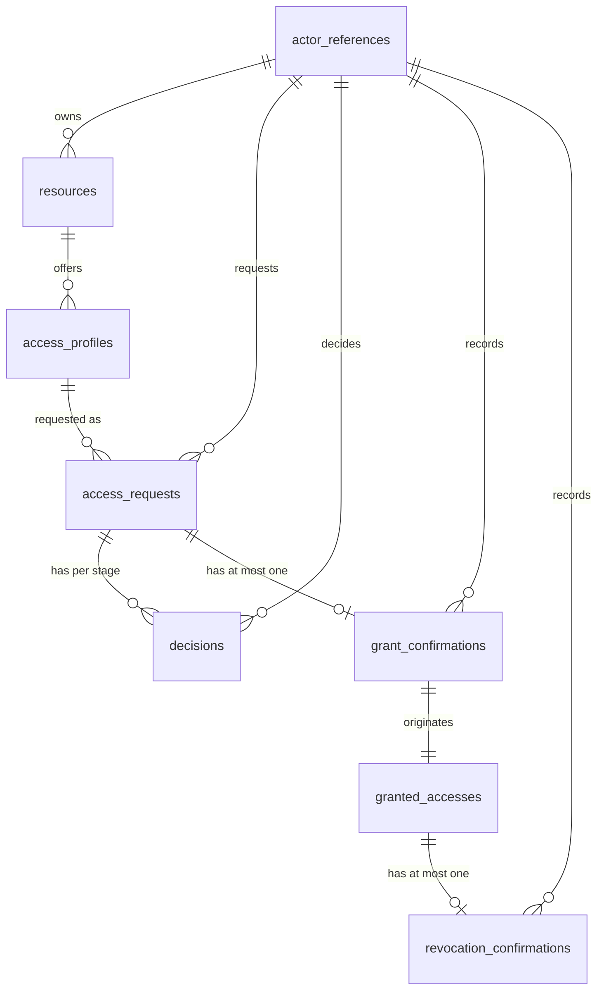

# Initial data model

This is the initial logical and physical persistence baseline of StewardArc. It documents [ADR-004](adr/0004-initial-data-model-baseline.md) and precedes the first migrations: no migration, model or table exists yet.

It is not a schema dump. Future migrations should be audited against this document, and this document should be updated when a later decision changes the baseline.

The conceptual model stays in [domain-model.md](domain-model.md); lifecycles and rules are described in [behavior.md](../behavior.md) and [requirements.md](../requirements.md).

## Conventions

- **Database:** PostgreSQL.
- **Identifiers:** column type `uuid`, holding UUIDv7 values generated by the application. No sequences, `serial`, database-generated UUIDs or PostgreSQL extensions.
- **Instants:** `timestamptz`, with semantic names (`requested_at`, `decided_at`, `recorded_at`, `valid_until_at`). Generic `created_at`/`updated_at` columns are not decided here and must not be used to reconstruct authorship or functional sequence.
- **Controlled values:** `text` plus CHECK constraints, never PostgreSQL native enums.
- **Foreign keys:** restrictive (`RESTRICT`/`NO ACTION`). No destructive cascade delete over functional facts.
- **Preserved facts:** decisions, grant confirmations and revocation confirmations are not edited or deleted by the normal functional operations of the MVP. No soft delete is introduced in this baseline.

## Tables

### `actor_references`

A person referenced by the domain. This is **not** an authentication table: it stores no password, token, secret or credential.

| Column | Type | Null | Constraint / meaning |
| --- | --- | --- | --- |
| `id` | `uuid` | NOT NULL | Primary key. UUIDv7 generated by the application. |
| `external_identity_key` | `text` | NOT NULL | UNIQUE. Opaque, stable key that allows a future mapping to the authenticated identity. No format is assumed. |
| `display_name` | `text` | NOT NULL | Name used when presenting the actor. |

### `resources`

| Column | Type | Null | Constraint / meaning |
| --- | --- | --- | --- |
| `id` | `uuid` | NOT NULL | Primary key. |
| `name` | `text` | NOT NULL | Resource name. |
| `resource_owner_actor_reference_id` | `uuid` | NOT NULL | FK → `actor_references.id`. In the MVP a resource has exactly one Resource Owner. |

### `access_profiles`

| Column | Type | Null | Constraint / meaning |
| --- | --- | --- | --- |
| `id` | `uuid` | NOT NULL | Primary key. |
| `resource_id` | `uuid` | NOT NULL | FK → `resources.id`. A profile belongs to exactly one resource. |
| `name` | `text` | NOT NULL | Profile name. |
| `classification` | `text` | NOT NULL | CHECK: `standard` or `privileged`. |
| `is_available` | `boolean` | NOT NULL | Whether the profile is available for new requests (`RN01`). |

### `access_requests`

| Column | Type | Null | Constraint / meaning |
| --- | --- | --- | --- |
| `id` | `uuid` | NOT NULL | Primary key. |
| `requester_actor_reference_id` | `uuid` | NOT NULL | FK → `actor_references.id`. The requester, who in the MVP requests for themselves (`RN02`). |
| `access_profile_id` | `uuid` | NOT NULL | FK → `access_profiles.id`. |
| `justification` | `text` | NOT NULL | Why the access is needed. |
| `approval_flow` | `text` | NOT NULL | CHECK: `standard` or `privileged`. Snapshot of the flow determined when the request was created, so a historical request is not reinterpreted if the catalog changes. |
| `requested_duration_seconds` | `integer` | NULL | Requested duration in whole seconds for a Privileged request (`RN07`). See the coherence CHECK below. |
| `current_state` | `text` | NOT NULL | CHECK: `S1`, `S2`, `S3`, `S4` or `S5`. Persisted current state (ADR-003). |
| `requested_at` | `timestamptz` | NOT NULL | When the request was registered. |

### `decisions`

A preserved fact: one approval or justified rejection at one stage.

| Column | Type | Null | Constraint / meaning |
| --- | --- | --- | --- |
| `id` | `uuid` | NOT NULL | Primary key. |
| `access_request_id` | `uuid` | NOT NULL | FK → `access_requests.id`. |
| `stage` | `text` | NOT NULL | CHECK: `resource_owner` or `governance`. |
| `outcome` | `text` | NOT NULL | CHECK: `approved` or `rejected`. |
| `actor_reference_id` | `uuid` | NOT NULL | FK → `actor_references.id`. Who decided (`RNF-004`). |
| `justification` | `text` | NULL | Required and non-blank when `outcome = 'rejected'` (`RN08`). Not forbidden on an approval. |
| `decided_at` | `timestamptz` | NOT NULL | When the decision was taken. |

### `grant_confirmations`

A preserved fact: the record that the grant was executed externally.

| Column | Type | Null | Constraint / meaning |
| --- | --- | --- | --- |
| `id` | `uuid` | NOT NULL | Primary key. |
| `access_request_id` | `uuid` | NOT NULL | UNIQUE. FK → `access_requests.id`. At most one confirmation per request. |
| `actor_reference_id` | `uuid` | NOT NULL | FK → `actor_references.id`. Who recorded the confirmation, not necessarily who executed the grant externally. |
| `recorded_at` | `timestamptz` | NOT NULL | When the confirmation was recorded. The effective validity period starts here. |

### `granted_accesses`

| Column | Type | Null | Constraint / meaning |
| --- | --- | --- | --- |
| `id` | `uuid` | NOT NULL | Primary key. |
| `grant_confirmation_id` | `uuid` | NOT NULL | UNIQUE. FK → `grant_confirmations.id`. |
| `valid_until_at` | `timestamptz` | NULL | Effective end of validity when a calculable end exists; NULL when there is none. |

This table has **no** state, status, lifecycle, expired or revoked column: `A1`/`A2`/`A3` are derived (ADR-003).

For a Privileged request, `valid_until_at` is the grant confirmation's `recorded_at` plus `requested_duration_seconds`. This relationship spans tables and is not expressed as a CHECK constraint; it is guaranteed by the domain operation and its transaction when implemented.

### `revocation_confirmations`

A preserved fact: the record that an access was revoked externally.

| Column | Type | Null | Constraint / meaning |
| --- | --- | --- | --- |
| `id` | `uuid` | NOT NULL | Primary key. |
| `granted_access_id` | `uuid` | NOT NULL | UNIQUE. FK → `granted_accesses.id`. At most one confirmation per granted access. |
| `actor_reference_id` | `uuid` | NOT NULL | FK → `actor_references.id`. Who recorded the confirmation. |
| `recorded_at` | `timestamptz` | NOT NULL | When the confirmation was recorded. |

## Relationships

- Resource 1 → N Access Profiles; each Access Profile belongs to exactly one Resource.
- Resource N → 1 Resource Owner Actor Reference (exactly one owner per resource in the MVP).
- Access Request N → 1 requester Actor Reference.
- Access Request N → 1 Access Profile.
- Access Request 1 → 0..N Decisions, with at most one Decision per stage.
- Access Request 1 → 0..1 Grant Confirmation.
- Grant Confirmation 1 → 1 Granted Access when the grant is recorded; every Granted Access originates from exactly one Grant Confirmation.
- Granted Access 1 → 0..1 Revocation Confirmation.
- Decisions, Grant Confirmations and Revocation Confirmations N → 1 Actor Reference, recording who acted.

## Integrity constraints

Guaranteed structurally by the database:

| Constraint | Table | Guarantee |
| --- | --- | --- |
| CHECK `classification` | `access_profiles` | Only `standard` or `privileged`. |
| CHECK `approval_flow` | `access_requests` | Only `standard` or `privileged`. |
| CHECK `current_state` | `access_requests` | Only `S1`, `S2`, `S3`, `S4` or `S5`. |
| CHECK duration coherence | `access_requests` | If `approval_flow = 'privileged'`, then `requested_duration_seconds` is NOT NULL, greater than 0 and at most 7776000 (90 × 24 × 60 × 60). If `approval_flow = 'standard'`, then `requested_duration_seconds` is NULL. |
| CHECK `stage` | `decisions` | Only `resource_owner` or `governance`. |
| CHECK `outcome` | `decisions` | Only `approved` or `rejected`. |
| CHECK rejection justification | `decisions` | When `outcome = 'rejected'`, `justification` is present and not blank (`RN08`). |
| UNIQUE (`access_request_id`, `stage`) | `decisions` | At most one decision per stage of a request. |
| UNIQUE `access_request_id` | `grant_confirmations` | At most one grant confirmation per request. |
| UNIQUE `grant_confirmation_id` | `granted_accesses` | One granted access per grant confirmation. |
| UNIQUE `granted_access_id` | `revocation_confirmations` | At most one revocation confirmation per granted access. |
| UNIQUE `external_identity_key` | `actor_references` | One actor reference per external identity key. |
| Unique partial index | `access_requests` | Over (`requester_actor_reference_id`, `access_profile_id`) restricted to `current_state IN ('S1','S2','S3')`. Prevents two equivalent requests in processing at the same time (part of `RN03`). The physical index name is not fixed here. |
| Restrictive foreign keys | all | `RESTRICT`/`NO ACTION`; no destructive cascade delete over functional facts. |

Domain and application rules that do **not** fit a simple CHECK, and are therefore enforced by the domain:

- `RN04` — nobody decides their own request.
- `RN05`, `RN06`, `RN09` — the required authority decides, in the required sequence.
- `RN10` — a grant is confirmed only after all required approvals, with the request in `S3`.
- `RN11` — a Resource Owner does not request a profile of their own resource.
- `RN02` — a request is made for the requester themselves.
- The value of `valid_until_at`, which derives from the grant confirmation's `recorded_at` and the requested duration.
- Who may record a grant confirmation or a revocation confirmation.

Deliberately deferred:

- The `RN03` half about an equivalent active Granted Access (see below).
- Concurrency control: isolation level, locking, retry and idempotency.

## Derived Granted Access state

A Granted Access has no status column. Its state is derived from the preserved facts, `valid_until_at` and the current time, following ADR-003. The temporal boundary is: before `valid_until_at` the access may still be active; at `valid_until_at` or later, the validity period has ended.

- **`A1` — Active:** no revocation confirmation exists, and either `valid_until_at` is NULL or the current time is before it.
- **`A2` — Ended by expiration:** `valid_until_at` is not NULL and the current time is at or after it, and either no revocation confirmation exists or its `recorded_at` is at or after `valid_until_at`.
- **`A3` — Ended by confirmed revocation:** a revocation confirmation exists whose `recorded_at` falls while the access was still active, that is, `valid_until_at` is NULL or `recorded_at` is before `valid_until_at`.

Consequences kept from ADR-003: a revocation confirmed after the validity has already ended leaves the access in `A2` while the confirmation remains preserved as a historical fact, and an access already in `A3` does not become `A2` as time passes.

No production SQL for this derivation is defined here.

## RN03 enforcement boundary

The unique partial index over (`requester_actor_reference_id`, `access_profile_id`) restricted to `S1`, `S2` and `S3` structurally prevents a second equivalent request while one is still in processing.

It does not cover the other half of `RN03`: a new request while an equivalent Granted Access is still active. That half depends on derived state — the presence and time of a revocation confirmation, `valid_until_at` and the current time — which a simple unique index cannot express.

No trigger, generated status column, scheduler, materialized `A1` flag, artificial exclusion constraint, lock, serializable transaction, advisory lock or idempotency key is introduced to close this gap now. The concurrent guarantee for this part of `RN03` must be defined in a later concurrency and invariant enforcement checkpoint, before the final implementation of `RF-002`.

## Functional History

Functional History has no table of its own and is not an audit log, operational telemetry or event sourcing. It is projected from the preserved facts:

- the functional registration of the request (`access_requests`, with `requested_at`);
- decisions and their rejection justifications (`decisions`);
- the grant confirmation (`grant_confirmations`);
- revocation confirmations (`revocation_confirmations`).

When the history presents expiration, that milestone is derived from `valid_until_at` and time. There is no expiration table and no persisted expiration event.

## Diagram

## Not modeled yet

- Authentication and session, and the concrete mapping from the authenticated identity to `external_identity_key`.
- More than one Resource Owner per resource.
- The concrete source of the Governance authority.
- Any removal or deactivation lifecycle for the catalog, and any soft delete.
- Generic `created_at`/`updated_at` columns.
- Performance indexes beyond those motivated by integrity.
- The concurrent enforcement mechanism for the `RN03` active access case.
- Isolation level, locking, retry and idempotency.
- Proactive time-related processing.
- Detailed API contracts and Laravel or Eloquent implementation details.
