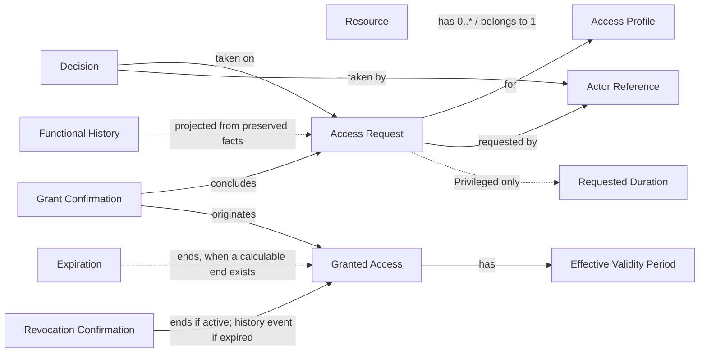

# Domain model

This is the **Conceptual Domain Model v1** of StewardArc. It describes concepts and their relationships. It is not a data model: it defines no identifiers, tables, columns, technical types, aggregates, repositories or packages.

Behavior and states are described in [../behavior.md](../behavior.md); architectural context in [overview.md](overview.md).

## Concepts

| Concept | Meaning |
| --- | --- |
| Resource | Something to which access is governed. |
| Access Profile | A requestable access to a resource, classified as Standard or Privileged, and available or not for new requests. |
| Actor Reference | The domain's reference to a person acting as Requester, Resource Owner or Governance. The authenticated identity itself is external. The actor of a confirmation is the person who records it, not necessarily who executed the change externally. |
| Access Request | A user's request, for themselves, for one access profile, stating why. Follows the lifecycle `S1`–`S5`; its current state is persisted ([ADR-003](adr/0003-lifecycle-state-and-persistence-baseline.md)). |
| Decision | An immutable fact in the lifecycle of an Access Request: an approval or a justified rejection by the authority of the pending step. |
| Requested Duration | The duration stated in a Privileged request (`RN07`). |
| Grant Confirmation | The record, made by the Resource Owner, that the grant was executed externally. It concludes the request (`S3 → S4`). |
| Granted Access | The access that exists only after grant confirmation. Follows the lifecycle `A1`–`A3`. |
| Effective Validity Period | The period of a Granted Access that starts at grant confirmation. It has a calculable end only when applicable, in particular when a Requested Duration exists (`RN07`). |
| Revocation Confirmation | The record, made by the Resource Owner, that an access was revoked externally. For an active access it causes `A1 → A3`; for an access already in `A2` it is preserved as a history event without changing `A2`. |
| Expiration | The end, in the governance model, of an effective validity period that has a calculable end (`A1 → A2`), derived from the Effective Validity Period and time ([ADR-003](adr/0003-lifecycle-state-and-persistence-baseline.md)). It does not prove external revocation. |
| Functional History | A capability, projected from the functional facts preserved by the domain, that presents a request's decisions and relevant lifecycle events and can present the expiration milestone derived from the Effective Validity Period and time. |

## Relationships

- Each Access Profile belongs to exactly one Resource. A Resource has zero or more Access Profiles.
- An Access Request is made by a requester for one Access Profile.
- Decisions are facts attached to the lifecycle of an Access Request.
- A Privileged Access Request carries a Requested Duration.
- A Grant Confirmation concludes an Access Request and originates a Granted Access.
- A Granted Access has an Effective Validity Period that starts at grant confirmation and has a calculable end only when applicable.
- An active Granted Access ends by Expiration, when a calculable validity end is reached, or by Revocation Confirmation.
- A Revocation Confirmation recorded for a Granted Access already ended by Expiration is preserved as a history event and does not change its state.
- This model does not imply that every Standard access expires by duration.
- The Functional History is projected from the preserved functional facts, such as decisions, grant confirmation and revocation confirmation, and can present the expiration milestone derived from the Effective Validity Period and time.

## Essential distinctions

- **Access Request and Granted Access are distinct entities.** An approved request is not an access; the Granted Access exists only after grant confirmation.
- **Decisions are immutable facts**, not mutable attributes of the request.
- **Functional History is not an operational audit log.** It is a functional capability over domain facts; operational telemetry is a separate concern.
- **Identity is external; authorization belongs to the product.**
- **Expiration is not proof of external revocation.**

## Not defined by this model

- Aggregates, repositories, modules, packages, namespaces or layers.
- Identifiers, data types, tables or columns.
- Whether a resource can have more than one Resource Owner.
- Cardinalities beyond those stated above.
