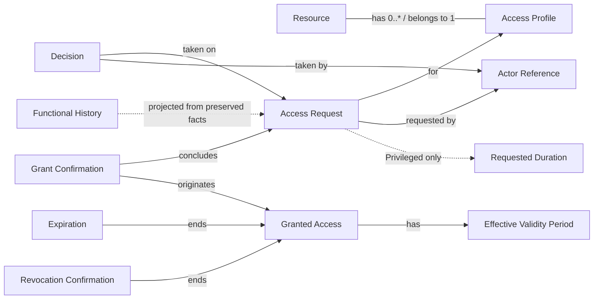

# Domain model

This is the **Conceptual Domain Model v1** of StewardArc. It describes concepts and their relationships. It is not a data model: it defines no identifiers, tables, columns, technical types, aggregates, repositories or packages.

Behavior and states are described in [../behavior.md](../behavior.md); architectural context in [overview.md](overview.md).

## Concepts

| Concept | Meaning |
| --- | --- |
| Resource | Something to which access is governed. |
| Access Profile | A requestable access to a resource, classified as Standard or Privileged, and available or not for new requests. |
| Actor Reference | The domain's reference to a person acting as Requester, Resource Owner or Governance. The authenticated identity itself is external. |
| Access Request | A user's request, for themselves, for one access profile, stating why. Follows the lifecycle `S1`–`S5`. |
| Decision | An immutable fact in the lifecycle of an Access Request: an approval or a justified rejection by the authority of the pending step. |
| Requested Duration | The duration stated in a Privileged request (`RN07`). |
| Grant Confirmation | The record that the grant happened externally. It concludes the request (`S3 → S4`). |
| Granted Access | The access that exists only after grant confirmation. Follows the lifecycle `A1`–`A3`. |
| Effective Validity Period | The period of a Granted Access that starts at grant confirmation and ends when the requested duration elapses. |
| Revocation Confirmation | The record that an access was revoked externally (`A1 → A3`). |
| Expiration | The end of the effective validity period in the governance model (`A1 → A2`). It does not prove external revocation. |
| Functional History | A capability, projected from facts preserved by the domain, that presents a request's decisions and relevant lifecycle events. |

## Relationships

- Each Access Profile belongs to exactly one Resource. A Resource has zero or more Access Profiles.
- An Access Request is made by a requester for one Access Profile.
- Decisions are facts attached to the lifecycle of an Access Request.
- A Privileged Access Request carries a Requested Duration.
- A Grant Confirmation concludes an Access Request and originates a Granted Access.
- A Granted Access has an Effective Validity Period that starts at grant confirmation.
- A Granted Access ends either by Expiration or by Revocation Confirmation.
- The Functional History is derived from the preserved facts: decisions, grant confirmation, expiration and revocation confirmation.

## Essential distinctions

- **Access Request and Granted Access are distinct entities.** An approved request is not an access; the Granted Access exists only after grant confirmation.
- **Decisions are immutable facts**, not mutable attributes of the request.
- **Functional History is not an operational audit log.** It is a functional capability over domain facts; operational telemetry is a separate concern.
- **Identity is external; authorization belongs to the product.**
- **Expiration is not proof of external revocation.**

## Not defined by this model

- Aggregates, repositories, modules, packages, namespaces or layers.
- Identifiers, data types, tables or columns.
- Whether `S3` or `A2` is persisted or derived.
- Whether a resource can have more than one Resource Owner.
- Cardinalities beyond those stated above.
