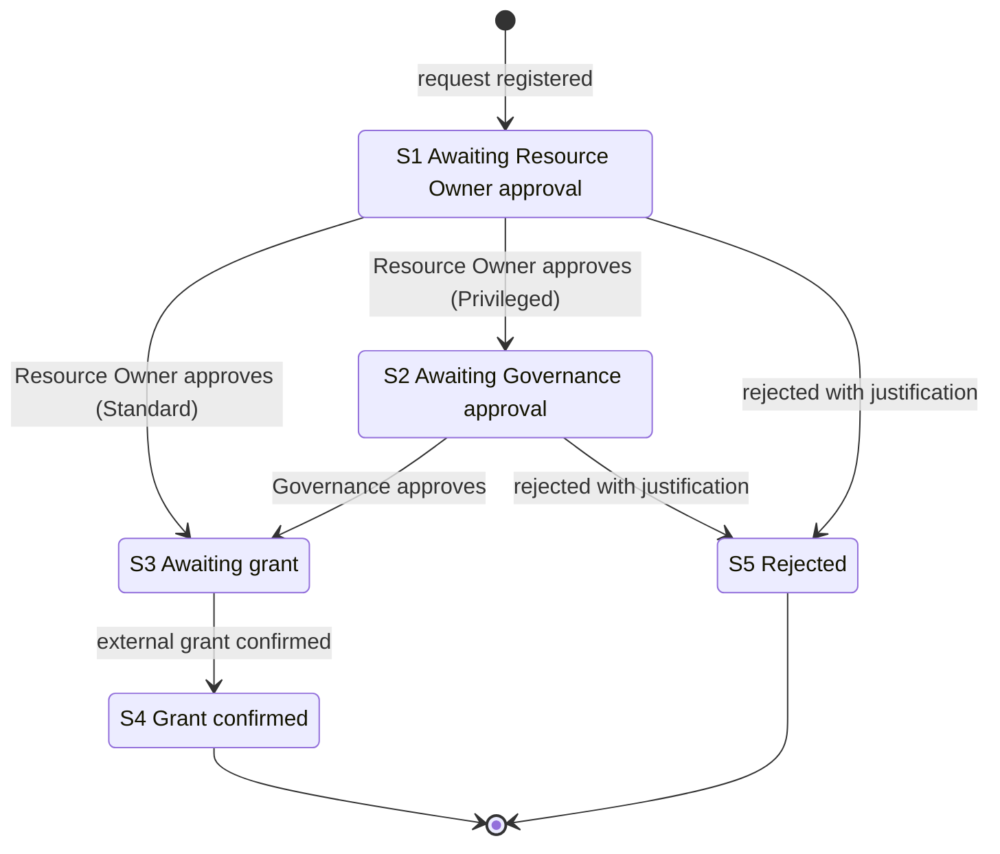
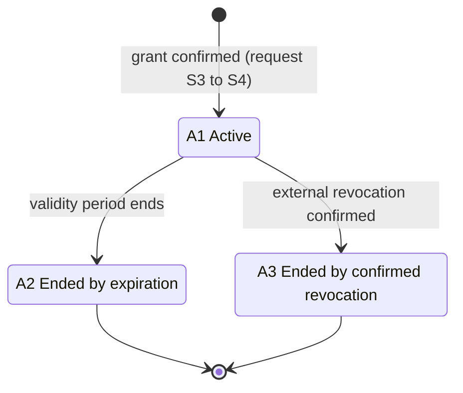

# Behavior

This document describes how StewardArc behaves: lifecycle vocabulary, states and transitions, approval flows, use cases and acceptance criteria. It is a curated version of the approved baselines *Functional Flows and States v1*, *Use Cases v1* and *Acceptance Criteria v1*.

Requirement and rule identifiers (`RF`, `RN`, `RNF`) are defined in [requirements.md](requirements.md).

## Two lifecycles

StewardArc has two distinct lifecycles:

- the **Access Request** lifecycle (`S1`–`S5`) covers the path from submission to decision and grant confirmation;
- the **Granted Access** lifecycle (`A1`–`A3`) starts only when a grant is confirmed and covers the access until it ends.

An approved request is not a Granted Access. The request waits in `S3` until the external grant is confirmed; only then does it reach `S4` and a Granted Access is created in `A1`.

## Access Request states

| State | Name | Terminal |
| --- | --- | --- |
| `S1` | Awaiting Resource Owner approval | No |
| `S2` | Awaiting Governance approval | No |
| `S3` | Awaiting grant | No |
| `S4` | Grant confirmed | Yes |
| `S5` | Rejected | Yes |

### Allowed transitions

| From | To | Trigger | Flow |
| --- | --- | --- | --- |
| `S1` | `S3` | Resource Owner approves | Standard |
| `S1` | `S2` | Resource Owner approves | Privileged |
| `S2` | `S3` | Governance approves | Privileged |
| `S1` | `S5` | Resource Owner rejects with justification | Standard, Privileged |
| `S2` | `S5` | Governance rejects with justification | Privileged |
| `S3` | `S4` | External grant is confirmed | Standard, Privileged |

No other transitions exist. `S4` and `S5` are terminal.

## Approval flows

The flow is determined by the requested profile (`RF-003`).

**Standard flow** (`RN05`): `S1 → S3 → S4`, with rejection at its decision step: `S1 → S5`.

**Privileged flow** (`RN06`): `S1 → S2 → S3 → S4`, with rejection at any current decision step: `S1/S2 → S5`.

In both flows:

- only the authority of the currently pending step can decide (`RN09`);
- nobody decides their own request (`RN04`);
- every rejection requires a justification and ends the request (`RN08`);
- approval does not grant access; the grant is confirmed afterwards (`RN10`).

## Granted Access states

| State | Name |
| --- | --- |
| `A1` | Active |
| `A2` | Ended by expiration |
| `A3` | Ended by confirmed revocation |

A Granted Access exists only after grant confirmation (`S3 → S4`).

| From | To | Trigger |
| --- | --- | --- |
| — | `A1` | Grant confirmed; effective validity period starts |
| `A1` | `A2` | Effective validity period ends |
| `A1` | `A3` | External revocation is confirmed |

Notes:

- The effective validity period starts at grant confirmation, never at approval. Time in `S3` does not consume validity (`RN07`).
- `A2` is a governance fact. It does not prove that a revocation happened in the target system.
- There is no direct renewal or reactivation. A later need requires a new request.

### RF-008: expiration without a use case

`RF-008` (end validity in governance by expiration) is automatic, time-based behavior, not a goal pursued by an actor. For that reason it deliberately has no use case of its own. Its objective coverage is `CA-017`.

## Use cases

### UC-001 — Request access

- **Primary actor:** Requester.
- **Goal:** request access to an available profile for themselves.
- **Outcome:** a valid request is registered in `S1`, following the Standard or Privileged flow.
- **Rules:** `RN01`, `RN02`, `RN03`, `RN07`, `RN11`.
- **Requirements:** `RF-001`, `RF-002`, `RF-003`.

### UC-002 — Decide access request

- **Primary actors:** Resource Owner; Governance for the Privileged step.
- **Goal:** approve or reject a request pending the actor's decision.
- **Outcome:** the request advances along its flow or ends in `S5`.
- **Rules:** `RN04`, `RN05`, `RN06`, `RN08`, `RN09`.
- **Requirements:** `RF-004`, `RF-005`.

### UC-003 — Confirm external access grant

- **Goal:** record that the access was granted externally for a request in `S3`.
- **Outcome:** the request moves `S3 → S4`, the Granted Access is created in `A1` and its effective validity period starts.
- **Rules:** `RN07`, `RN10`.
- **Requirements:** `RF-006`.

### UC-004 — Record external access revocation

- **Goal:** record that an active access was revoked externally.
- **Outcome:** the Granted Access moves `A1 → A3`.
- **Requirements:** `RF-007`.

### UC-005 — Follow my requests

- **Primary actor:** Requester.
- **Goal:** follow the state of their own requests.
- **Requirements:** `RF-009`.

### UC-006 — Consult accesses and history

- **Goal:** consult Granted Access records and the history of requests, within the actor's functional scope.
- **Requirements:** `RF-010`, `RF-011`.

## Acceptance criteria

| ID | Verifiable behavior |
| --- | --- |
| CA-001 | Consulting the catalog shows the profiles available for new requests. |
| CA-002 | A valid request is registered and enters its lifecycle. |
| CA-003 | A request for an unavailable profile is prevented. |
| CA-004 | A request on behalf of another user is prevented. |
| CA-005 | A duplicate request is prevented while an equivalent request is in progress or an equivalent access is active. |
| CA-006 | A Resource Owner is prevented from requesting for themselves a profile of their own resource. |
| CA-007 | The duration of a Privileged request is validated according to `RN07`. |
| CA-008 | Pending approvals are restricted to the applicable scope and authority. |
| CA-009 | Approval in the Standard flow moves the request from `S1` to `S3`. |
| CA-010 | The Privileged flow follows `S1 → S2 → S3`. |
| CA-011 | Self-approval is prevented. |
| CA-012 | A decision outside the current authority or step is prevented. |
| CA-013 | A rejection requires a justification and ends the request in `S5`. |
| CA-014 | The request remains in `S3` while the external grant is not confirmed, without consuming validity. |
| CA-015 | Grant confirmation before all approvals are complete is prevented. |
| CA-016 | Grant confirmation moves the request `S3 → S4`, creates the Granted Access and starts its effective validity period. |
| CA-017 | At the end of the validity period, the access ends by expiration, moving `A1 → A2`. |
| CA-018 | A confirmed external revocation is recorded, moving `A1 → A3`. |
| CA-019 | After an access ends, a new need requires a new request; there is no direct renewal or reactivation. |
| CA-020 | Queries respect the functional scope of the actor. |
| CA-021 | The request history preserves the relevant lifecycle events and decisions. |
